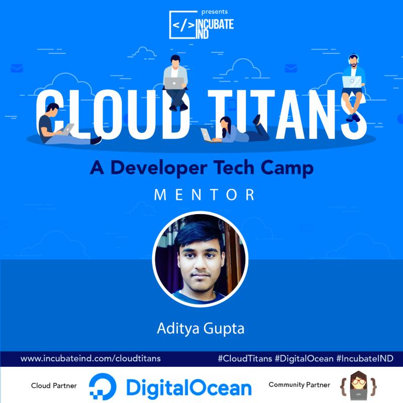

# Introduction :- 

✨ This is a Hackathon by [IncubateIND](https://incubateind.com) and sponsored by [Digital Ocean](https://www.digitalocean.com/) named [Cloud Titans](https://incubateind.com/cloudtitans).

✨ Consists of all the projects under "Implement a Post COVID-19 Solution for Economic Sector and Technical Domains".

✨ Project Mentor- Aditya Gupta

🤝  [Github](http://www.github.com/aftex261)

🤝  [LinkedIn](https://www.linkedin.com/in/aditya-g-205674193/)

🎊 

# Challenge Documentation :- 

📌 Brief Introduction about the Challenge 👇

The project aims to build a platform in which you have to analyze the current scenario of COVID-19 and then figure out the technical domains where one should contribute to in upcoming time to get the maximized results in his/her career and what are the domains which will rise up exponentially post COVID-19.

📌 More features in the final submission will be like 👇

▪Graphs for visualization of the cases which are affected.

▪Previous years situation before COVID-19.

▪The platform should have an email subscription who wants the detailed survey on their respective email-id.

▪Represent the number of cases affected. 

📌 Step Wise Approach 👇

Creating a platform (website or mobile application) which should represent the growth and downfall of the domains post COVID-19 situation and represent the number of people(cases) affected and use cases. The website or the mobile application should be accessible to all and highly responsive and an eye-catcher.

📌 Tech Stack 👇

👨‍💻 For Backend Development 👇

◻ Python 3 or Julia, any database like (MongoDB, Firebase), Cloud Platform :- (AWS/GCP/Digital Ocean) 

👨‍💻 For Frontend Development 👇

◻ (HTML, CSS or JavaScript) or React, Flutter
